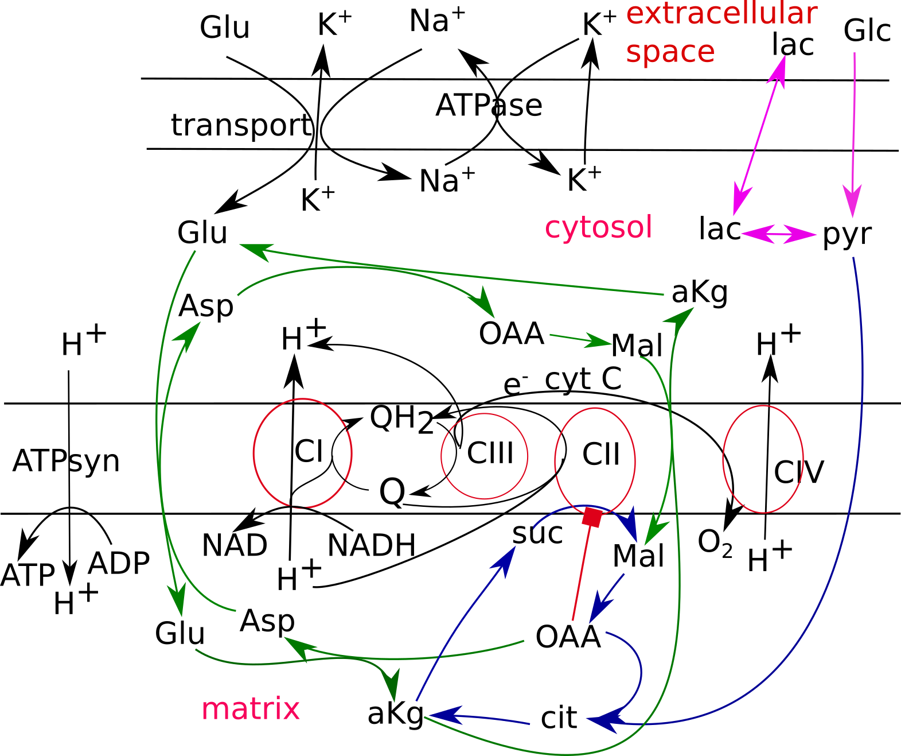

# cell_mito
Version: 1.0

Kinetic model of mitochondrial respirationlinked with cellular energetic metabolism and glutamate transport in neurons
The software tool “Mitodyn” supports an analysis of mitochondrial and cellular energy metabolism dynamics. It is based on a kinetic model, i.e., a system of ordinary differential equations (ODE) that describes mitochondrial electron transport, biochemical reactions providing substrates for the electron transport, oxidative phosphorylation, ATP consumption and transport of some metabolites through the cellular and inner mitochondrial membranes. It is customized for the neuronal cells.
Mitodyn provides a possibility to simulate time course of model variables, which are the concentrations of metabolites and redox states of respiratory complexes described by the ODE system, production of reactive oxygen species (ROS) separately in various sites of the electron transport chain. It allows to program the change of rate constants and concentrations in the course of a calculation, which simulate specific experimental conditions. Mitodyn enables continuous calculations of dependencies of the system steady states on model parameters. The latter can help to find bifurcation characteristics of the system.
